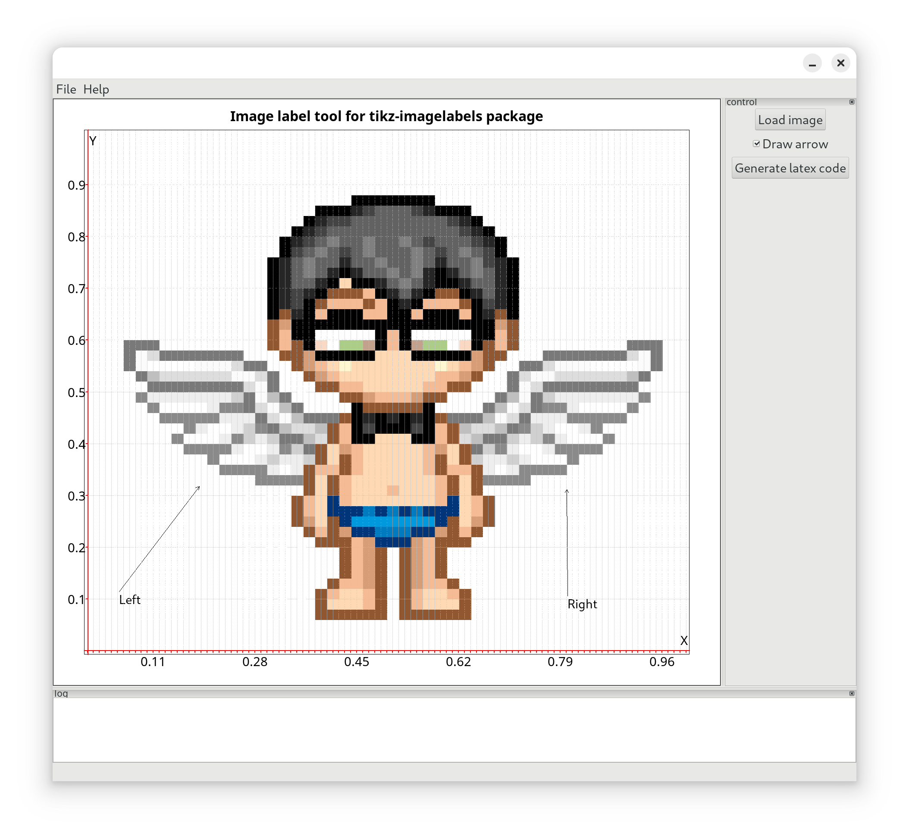
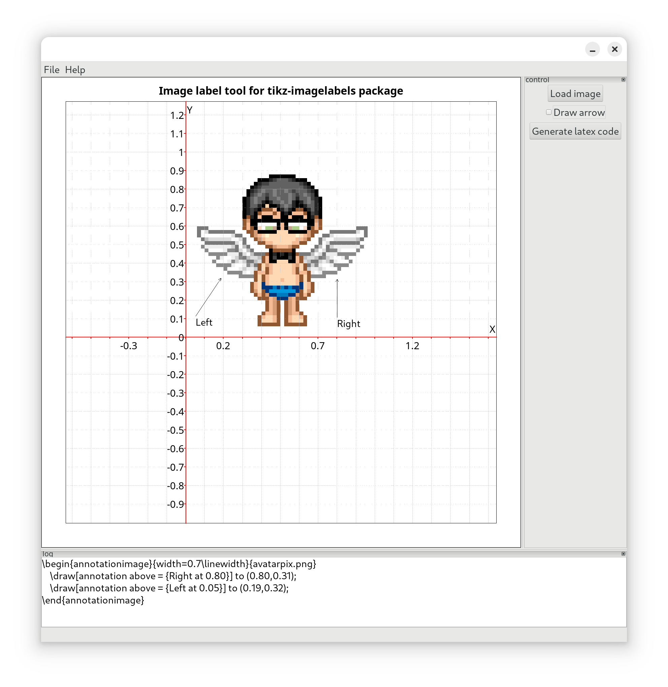
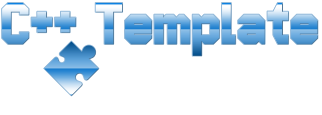

# ImageLabelGuiFree

<!--

  
 -->

This is a GUI tool to quickly add annotations for an image. It tries to support the Latex package: tikz-imagelabels package or tikz-imagelabels – Put labels on images using TikZ

Original code by [asmwarrior](https://github.com/asmwarrior/image-label-gui)

Implemented to DotName **[DotName C++ Template](https://github.com/tomasmark79/DotNameCppFree)**

---

**[DotName C++ Template](https://github.com/tomasmark79/DotNameCppFree)** – Searching for a reliable solution for your CMake projects? This template 🛠️ offers a clean and scalable project structure, cross-platform compatibility, and adherence to modern C++ practices. Start building confidently! 🚀

## License

MIT License  
Copyright (c) 2024-2025 Tomáš Mark